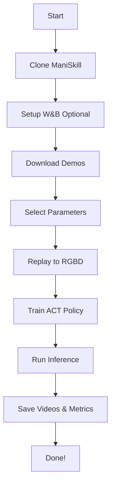

<div align="center">

# ManiSkill ACT Training Scripts

<p align="center">
  <a href="https://github.com/Vivek-049/Arm-manipulation-in-Maniskill">GitHub</a> •
  <a href="#quick-start">Quick Start</a> •
  <a href="#demo-notebooks">Demo Notebooks</a> •
  <a href="#configuration-options">Configuration</a>
</p>

---

</div>

## What is This?

A **production-ready** training setup for **Action Chunking with Transformers (ACT)** on **ManiSkill** robotics tasks. Designed for researchers, hobbyists, and teams who want to train imitation learning policies **fast** without setup headaches.

---

## Quick Start

### Prerequisites
- **Python 3.8+**
- **Git**
- **ManiSkill-compatible environment**

### Step 1: Clone the Repository

```bash
git clone git@github.com:Vivek-049/Arm-manipulation-in-Maniskill.git
cd Arm-manipulation-in-Maniskill
```

### Step 2: Setup Environment

```bash
bash setup_maniskill.sh
```

This installs ManiSkill, sets up Vulkan for rendering, and verifies your environment.

**After setup**, you can explore demo trajectories using `maniskill_official_replay.ipynb`.

### Step 3: Train ACT Policy

```bash
bash train_act.sh
```

The script will guide you through:
- W&B setup (optional)
- Number of demos to use (recommended: 100)
- Training iterations (recommended: 30,000 for PickCube)
- Evaluation settings

**After training**, visualize results using `visualize_results.ipynb`.

---

## Demo Notebooks

Use the included notebooks to inspect demonstrations and review trained policy outputs:

### `maniskill_official_replay.ipynb`
- Download and replay ManiSkill demo trajectories
- Generate demonstration videos
- Inspect observation modes such as state and RGBD

### `visualize_results.ipynb`
- Open generated replay and inference videos
- Compare policy rollouts after training
- Browse results from the `results/` directory

## Project Structure

```
Arm-manipulation-in-Maniskill/
├── train_act.sh                    # Main training pipeline
├── setup_maniskill.sh              # Environment setup script
├── maniskill_official_replay.ipynb # Demo exploration
├── visualize_results.ipynb         # Results viewer
└── README.md                       # You are here
```

## Configuration Options

The script uses **interactive prompts** with sensible defaults, but you can also set environment variables:

```bash
export TOTAL_ITERS=50000        # Training iterations
export EVAL_FREQ=5000           # Evaluate every N iterations
export NUM_DEMOS=100            # Number of demonstrations
export MAX_EPISODE_STEPS=125    # Episode length
export NUM_EVAL_ENVS=10         # Parallel eval environments
export SEED=42                  # Random seed

bash train_act.sh
```

### Example Settings by Task

| Task | Demos | Iterations | Expected Result |
|------|-------|-----------|-----------------|
| PickCube-v1 | 100 | 30,000 | Strong baseline |
| StackCube-v1 | 200 | 100,000 | Good baseline |
| PushT | 300 | 100,000 | Good baseline |
| Custom (Hard) | 500+ | 400,000 | Varies |

## Training Pipeline Details

### Step-by-Step Workflow



### Training Details
- **Architecture:** Action Chunking Transformer (ACT)
- **Observations:** RGBD (RGB + Depth images)
- **Backend:** ManiSkill simulation
- **Optimizer:** AdamW
- **Scheduler:** Cosine annealing

## Video Outputs

After training completes, check:

```bash
results/
├── replay_videos/           # Expert demonstrations
│   ├── trajectory_0.mp4
│   ├── trajectory_1.mp4
│   └── ...
└── inference_videos/        # Trained policy
    ├── episode_0.mp4
    ├── episode_1.mp4
    └── ...
```

Use `visualize_results.ipynb` to view them in Jupyter!

## Resources

### Official Documentation
- [ManiSkill Docs](https://maniskill.readthedocs.io/)
- [ACT Paper](https://arxiv.org/abs/2304.13705)
- [ManiSkill GitHub](https://github.com/haosulab/ManiSkill)

### Tutorials & Guides
- [ManiSkill ACT Baseline](https://github.com/haosulab/ManiSkill/tree/main/examples/baselines/act)
- [Imitation Learning Basics](https://huggingface.co/learn/deep-rl-course/unit7/introduction)

## License

This project inherits the license from the original [ManiSkill](https://github.com/haosulab/ManiSkill) repository (MIT License).

Scripts and notebooks in this repository are provided as-is for educational and research purposes.

---

## Acknowledgments

This repository is built on top of the excellent work from:

- **[ManiSkill Team](https://github.com/haosulab/ManiSkill)** - For the incredible robotics simulation platform
- **[ACT Authors](https://tonyzhaozh.github.io/aloha/)** - For the Action Chunking Transformer architecture

Special thanks to all contributors and the robotics community!

---

<div align="center">

### If this helped you, consider starring the repo!

[](https://github.com/Vivek-049/Arm-manipulation-in-Maniskill)
[](https://github.com/Vivek-049/Arm-manipulation-in-Maniskill/fork)

</div>
